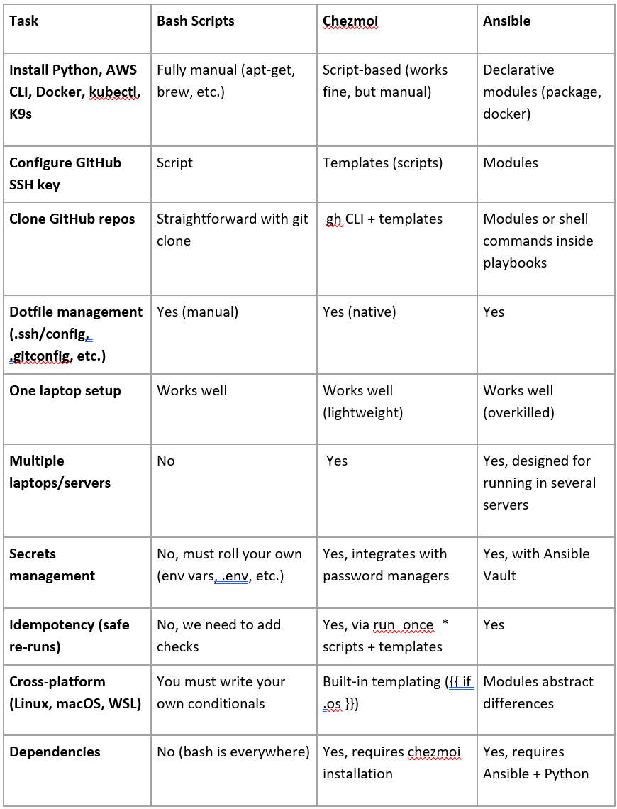

# Automating Project Setup

## Problem
A solution is needed to automate project setup.

## Requirements
1. Install the following packages:
   - Python
   - AWS CLI
   - kubectl CLI
   - Docker Engine (not Docker Desktop)
   - K9S
2. Configure a GitHub SSH key
3. Clone all GitHub repositories

## Option 1: Using a Bash Script

### Advantages
- One-time task
- Fast and simple for quick configurations
- Best suited for a small number of servers
- No dependencies (runs directly in the shell without requiring additional tools)

### Disadvantages
- Limited error handling (requires manual intervention)
- Reduced readability (complex scripts can be difficult to maintain)
- No state awareness (does not track the system's state)

### Clone Repositories - Example
```bash
#!/bin/bash
mkdir projects
cd projects

repos=$(curl -s https://api.github.com/users/gniches/repos | grep ssh_url | cut -d'"' -f 4)

for repo in $repos
do
    git clone $repo
done
```

### Configure SSH Key – Example
```bash
# Generate SSH key pair if it doesn't exist
SSH_KEY_PATH="$HOME/.ssh/id_rsa"
if [ ! -f "$SSH_KEY_PATH" ]; then
    echo "Generating a new SSH key pair..."
    ssh-keygen -t rsa -b 4096 -C "$GITHUB_USERNAME@github" -f "$SSH_KEY_PATH" -N "" || error_exit "Failed to generate SSH key."
else
    echo "SSH key already exists at $SSH_KEY_PATH."
fi

# Add SSH key to the ssh-agent
eval "$(ssh-agent -s)" || error_exit "Failed to start ssh-agent."
ssh-add "$SSH_KEY_PATH" || error_exit "Failed to add SSH key to ssh-agent."

# Read the public key
PUBLIC_KEY=$(cat "$SSH_KEY_PATH.pub") || error_exit "Failed to read public key."

# Add the public key to GitHub
echo "Adding the SSH key to your GitHub account..."
RESPONSE=$(curl -s -X POST -H "Authorization: token $GITHUB_TOKEN" -H "Content-Type: application/json" -d "{\"title\":\"$(hostname) - $(date)\",\"key\":\"$PUBLIC_KEY\"}" https://api.github.com/user/keys)
```

## Option 2: Using an Ansible Playbook

### Advantages
- Easily manages multiple servers
- Idempotent (skips tasks if already completed)
- Scalable (handles large environments with minimal changes)
- Agentless (no additional software required on the target machines)

### Disadvantages
- Requires Ansible to be installed first (bootstrapping step)
- Slower execution compared to shell scripts

### Configure GitHub SSH Key – Example
```yaml
- name: Read SSH public key to authorize
  ansible.builtin.shell: cat /home/foo/.ssh/id_rsa.pub
  register: ssh_pub_key

- name: Authorize key with GitHub
  local_action:
    module: github_key
    name: Access Key for Some Machine
    token: '{{ github_access_token }}'
    pubkey: '{{ ssh_pub_key.stdout }}'
```

### Clone GitHub Repositories – Example
```yaml
---
- hosts: all
  tasks:
    - name: Clone a GitHub repository
      git:
        repo: https://github.com/sqlite/sqlite.git
        dest: /home/debian/repos/
        clone: yes
        update: yes
```

## Option 3: Using Chezmoi

Chezmoi is a dotfile manager that goes beyond simply storing configuration files. It allows you to manage dotfiles declaratively and run executable scripts, enabling full system setup such as installing packages through package managers (e.g., Homebrew).

### Advantages
- Declarative management of configuration and packages
- Centralized management of dotfiles and scripts
- Cross-platform (Linux, macOS, Windows WSL)
- Easily reproducible environments

### Disadvantages
- Best suited for personal/system configuration rather than multi-server orchestration
- Limited ecosystem compared to Ansible
- Requires Chezmoi to be installed first

### Example Script
```bash
#!/bin/bash
set -euo pipefail

# Ensure GitHub CLI is installed
if ! command -v gh >/dev/null 2>&1; then
    echo "GitHub CLI not installed. Exiting."
    exit 1
fi

# Authenticate (interactive once, stores token in ~/.config/gh)
gh auth login --hostname github.com --git-protocol ssh --web

# Upload personal key
if [ -f ~/.ssh/id_ed25519_github_personal.pub ]; then
    gh ssh-key add ~/.ssh/id_ed25519_github_personal.pub \
      --title "Laptop Personal Key" \
      --visibility private
fi
```

## Comparison Between Tools



## Open Questions

### Is Ansible the right choice?
Ansible has several advantages; however, it is usually used to configure multiple remote servers at once.

### Can Ansible do everything we need?
Ansible can automate most of the required configurations, but some steps still need to be done manually, such as adding an SSH key to a GitHub repository.

### What would be the best approach to solve the issue?
The simplest approach is using a Bash script. You can run the script directly on your laptop without additional dependencies, and only a few configurations need to be automated:
1. Install dependencies
2. Generate and configure a GitHub SSH key / Generate a GitHub Personal Access Token
3. Edit the script with your GitHub username and token
4. Run the script

Chezmoi would be a nice addition, as it can manage both configuration management (dotfiles, secrets, idempotency) and setup scripts (installing packages, configuring repositories) together.

### Can we use Homebrew to install everything we need?
Yes. On both WSL2 and macOS, we can easily install Homebrew and use it to install the required packages.